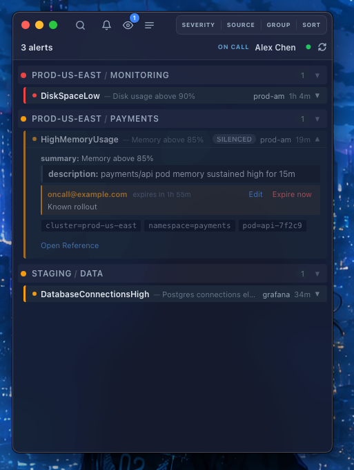

<p align="center">
  
</p>

<h1 align="center">Foghorn</h1>

<p align="center">
  Your alerts, together on your desktop. macOS, Linux, and Windows.
</p>

Foghorn brings Alertmanager, Grafana Alerting, Prometheus, and Better Stack into one desktop app. See what is firing across your sources, get native notifications, and manage silences without switching between dashboards.



*Native macOS window with synthetic demo alerts. Source names, infrastructure details, and the on-call person are fictional.*

## Download and install

Download the package for your platform from the [latest release](https://github.com/sammy8806/foghorn/releases/latest). No Go or Node.js installation is needed to run a release build.

| Platform | Package | Installation |
| --- | --- | --- |
| macOS, Apple Silicon and Intel | Universal `.dmg` | Open the disk image and drag Foghorn into Applications. |
| Linux, x86_64 | `.AppImage` | Install the runtime packages below, make the file executable, and run it. |
| Windows, x64 | `-amd64-installer.exe` | Run the installer. It also installs WebView2 if needed. |

Then add your alert sources using the [configuration guide](#configuration-and-first-run). Allow desktop notifications when prompted. On macOS and Windows, closing the window keeps Foghorn in the tray; use its tray menu to quit.

Linux release builds use your system's GTK/WebKitGTK libraries. Install them before opening the AppImage:

```bash
# Fedora
sudo dnf install webkit2gtk4.1 gtk3 libayatana-appindicator-gtk3

# Ubuntu 24.04 / Kubuntu
sudo apt install libwebkit2gtk-4.1-0 libgtk-3-0 libayatana-appindicator3-1

# Replace the version with the release you downloaded.
chmod +x "foghorn-<version>-x86_64.AppImage"
./"foghorn-<version>-x86_64.AppImage"
```

KDE also needs these GTK libraries. GNOME needs AppIndicator support to show a tray icon; Foghorn remains usable as a regular window when the tray is unavailable.

## Features

- Connect multiple instances of Alertmanager, Grafana Alerting, Prometheus, and Better Stack. Sources poll independently, so a slow source does not block the others.
- View, create, edit, and expire silences on sources that support them. Build silence matchers from an alert or a search query.
- Search with free text, negation, exact label matches, and regular expressions. Filter by severity or source, and choose grouping and sorting presets.
- Show the current Better Stack on-call engineer and follow links to incidents.
- Receive native desktop notifications and monitor alert state from the system tray.
- Configure severity aliases, visible labels and annotations, grouping, sorting, hide rules, and popup placement in YAML. Configuration reloads on save.
- Connect through basic, bearer, cookie, or OIDC device authentication where supported. Persist OIDC logins in macOS Keychain, Linux Secret Service, or Windows Credential Manager.
- Diagnose source failures, configuration errors, and notification permissions directly in the app. Adjust text or interface scaling for readability.

See the [search guide](docs/search.md), [sorting guide](docs/sorting.md), and [OIDC setup guide](docs/oidc-device-auth.md) for details.

## Configuration and first run

Foghorn reads `config.yaml` from the following location. After starting the app for the first time, edit this file to connect your alert sources:

| Platform | Configuration file |
| --- | --- |
| macOS | `~/Library/Application Support/foghorn/config.yaml` |
| Linux | `~/.config/foghorn/config.yaml`, or `$XDG_CONFIG_HOME/foghorn/config.yaml` |
| Windows | `%APPDATA%\\foghorn\\config.yaml` |

If the file is missing, copy [config.example.yaml](config.example.yaml) to that location first. The current app falls back to in-memory defaults and does not automatically install the example. Existing configurations from the legacy location are migrated when applicable.

Set your source URLs and authentication, then save. Foghorn reloads configuration on save and reports configuration or connection problems in the app.

**[Configuration guide and provider examples](docs/configuration.md)**

## Documentation

- [Configuration](docs/configuration.md): file locations, sources, authentication, and command-line tools.
- [Search](docs/search.md): text, label matchers, regular expressions, and creating silences.
- [Sorting](docs/sorting.md): presets and provider-specific behavior.
- [Resolvers](docs/resolvers.md): transform field values with local processes.
- [OIDC authentication](docs/oidc-device-auth.md): device login and saved credentials.
- [FAQ and troubleshooting](docs/troubleshooting.md): setup, source failures, and silence debugging.
- [Development and source builds](docs/development.md): prerequisites, platform builds, and releases.

## License

TBD.
